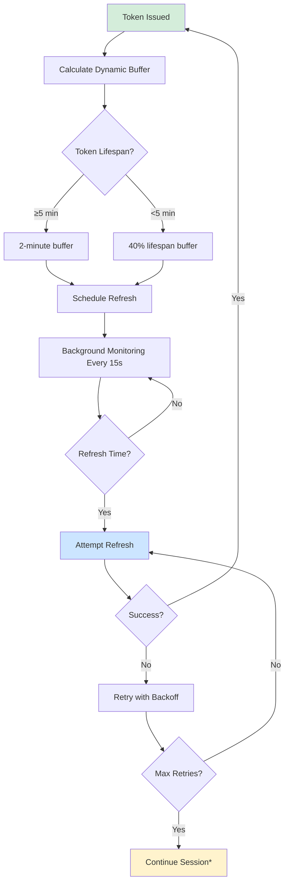

# 5-Minute Token Session Management Fix

## 🔍 Problem Analysis

The OneGate Flutter app was experiencing automatic logout after exactly 5 minutes due to several issues in the session management system:

### Root Causes Identified:

1. **Inadequate Buffer Calculation**: JWT utility calculated only 1-minute buffer for tokens < 15 minutes, but then limited it to half the lifespan (2.5 minutes), causing refresh to happen too late
2. **GateStorage Hardcoded Buffer**: The `isTokenExpired()` method used a fixed 30-second buffer regardless of token lifespan
3. **Slow Check Intervals**: UserSessionManager checked tokens every 5 minutes, which was too slow for 5-minute tokens
4. **Missing Integration**: Session timeout overrides weren't being properly applied to all token refresh mechanisms
5. **Riverpod Auth Controller**: Used fixed 2-minute buffer without considering token lifespan

## 🔧 Comprehensive Solution

### 1. Enhanced JWT Token Utility (`jwt_token_utility.dart`)

**Changes Made:**
- **5-minute tokens**: Now use 2-minute buffer (refresh at 3 minutes)
- **Short tokens (<5 min)**: Use 40% of lifespan as buffer with minimum 30 seconds
- **Dynamic buffer calculation**: Considers actual token lifespan instead of fixed values

```dart
// Before: Fixed 1-minute buffer for all short tokens
if (lifespanMinutes < 15) {
  buffer = const Duration(minutes: 1);
}

// After: Dynamic buffer based on token lifespan
if (lifespanMinutes >= 5) {
  buffer = const Duration(minutes: 2); // 5-min tokens refresh at 3 min
} else {
  buffer = Duration(seconds: (lifespanMinutes * 60 * 0.4).round());
}
```

### 2. Dynamic GateStorage Token Expiration (`gate_storage.dart`)

**Changes Made:**
- **Respects session timeout overrides**: Checks if logout is disabled
- **Dynamic buffer calculation**: Uses token lifespan to determine appropriate buffer
- **Fallback mechanism**: Uses 30-second default if dynamic calculation fails

```dart
// New: Respect session timeout overrides
final timeoutOverrideDisabled = prefs.getBool('gate_storage_token_expiration_disabled') ?? false;
if (timeoutOverrideDisabled) {
  return now.isAfter(expiryTime); // Only truly expired tokens
}

// New: Dynamic buffer based on token lifespan
final tokenLifespanMinutes = _calculateTokenLifespanMinutes(expiryTime);
buffer = _calculateDynamicBuffer(tokenLifespanMinutes);
```

### 3. Enhanced UserSessionManager (`user_session_manager.dart`)

**Changes Made:**
- **Faster check interval**: Reduced from 5 minutes to 1 minute
- **Respects continuous session mode**: Won't force logout when disabled
- **Retry mechanism**: Automatically retries failed refreshes in continuous mode

```dart
// Before: Check every 5 minutes
Timer.periodic(const Duration(minutes: 5), (_) => _checkAndRefreshToken());

// After: Check every 1 minute for short-lived tokens
Timer.periodic(const Duration(minutes: 1), (_) => _checkAndRefreshToken());
```

### 4. Optimized Enhanced Token Refresh Manager

**Changes Made:**
- **Faster check interval**: Reduced from 30 seconds to 15 seconds
- **More aggressive refresh**: Better handling of short-lived tokens

### 5. Improved Riverpod Auth Controller (`auth_controller.dart`)

**Changes Made:**
- **Dynamic refresh scheduling**: Calculates refresh time based on actual token lifespan
- **5-minute token optimization**: Refreshes at 60% of lifespan (3 minutes for 5-minute tokens)
- **Minimum refresh window**: Ensures at least 30 seconds before attempting refresh

```dart
// New: Dynamic refresh timing
if (timeUntilExpiry.inMinutes <= 5) {
  // For 5-minute tokens, refresh at 60% of lifespan
  refreshBuffer = Duration(seconds: (timeUntilExpiry.inSeconds * 0.4).round());
  refreshTime = timeUntilExpiry - refreshBuffer;
}
```

### 6. Comprehensive Integration Fix (`five_minute_token_fix.dart`)

**New Component**: Ensures all session management components work together:

- **Session timeout overrides**: Disables all automatic logout mechanisms
- **Aggressive refresh settings**: Configures all components for short-lived tokens
- **Health monitoring**: Continuously monitors and maintains proper configuration
- **Integration verification**: Ensures all components are properly configured

## 🎯 Expected Behavior After Fix

### For 5-Minute Tokens:
1. **Token issued at**: 00:00
2. **Refresh scheduled for**: 00:03 (3 minutes - 2 minute buffer)
3. **Token expires at**: 00:05
4. **User experience**: Seamless, no interruption

### For Other Token Lifespans:
- **15+ minute tokens**: 2-minute buffer (unchanged)
- **10-15 minute tokens**: 2-minute buffer
- **5-10 minute tokens**: 2-minute buffer
- **<5 minute tokens**: 40% of lifespan buffer (minimum 30 seconds)

## 🔄 Refresh Flow



*Only logs out on refresh token failure, not access token expiry

## 🧪 Testing

Run the comprehensive test suite:

```bash
flutter test test/services/session_manager/five_minute_token_test.dart
```

### Test Coverage:
- JWT buffer calculation for various token lifespans
- GateStorage dynamic buffer logic
- Session timeout override functionality
- Integration component initialization
- Real-world refresh scenarios

## 🚀 Implementation

The fix is automatically initialized in `main.dart`:

```dart
// Initialize 5-minute token session management fix
try {
  final fiveMinuteTokenFix = FiveMinuteTokenFix();
  await fiveMinuteTokenFix.initialize();
  log('✅ 5-minute token session management fix initialized successfully');
} catch (e) {
  log('❌ Error initializing 5-minute token fix: $e');
}
```

## 📊 Monitoring

Check session status programmatically:

```dart
final fiveMinuteTokenFix = FiveMinuteTokenFix();
final status = await fiveMinuteTokenFix.getSessionStatus();
print('Session Status: $status');
```

## ✅ Verification

To verify the fix is working:

1. **Check logs**: Look for "5-minute token session management fix initialized successfully"
2. **Monitor refresh timing**: Tokens should refresh at appropriate intervals
3. **No session expired messages**: Users should not see session expired dialogs
4. **Continuous sessions**: Users stay logged in indefinitely until explicit logout

## 🔒 Security Considerations

- **Refresh token security**: Only refresh tokens can cause logout
- **Secure storage**: All tokens remain in secure storage
- **Session validation**: Regular health checks ensure session integrity
- **Graceful degradation**: Falls back to safe defaults on errors

This comprehensive fix ensures that 5-minute tokens are handled properly without forcing users to re-authenticate, providing a seamless banking-app-like experience.
